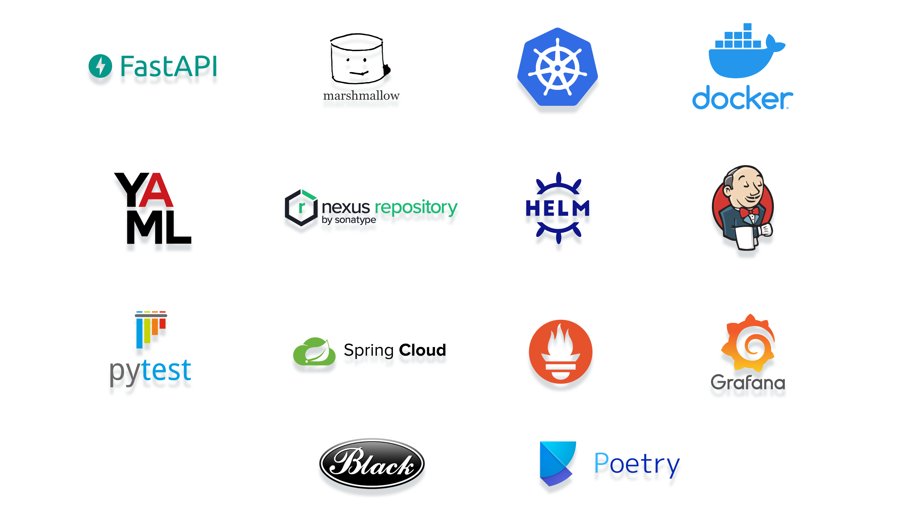

<h1 align="center">From zero to production in less than a day</h1>
<h3 align="center">A template for hosting your ML solutions quickly with fastAPI </h3>

	
	
    
	
	
   

	

Do you have an amazing Machine Learning Solution but you are thinking you do not know how to create a webservice out of it? Well, this project exactly solves your problem. This repo can be used as a kickstarter to convert your local ML application into a running webservice that can be deployed to the server/local.

This is an example project that can help you understand the framework and design of FastAPI that is generally used at Media Distillery.

<h3>In addition, you can also learn about other activities needed to deploy a solution to servers [Production], including:</h3>

- Dependency management and packaging in Python using Poetry.
  * How a simple <b><i> pyproject.toml</b></i> looks like for poetry, can be found under each package. 
- Creating the deployable containers of the ML services using Docker.
  * Example <b><i> Dockerfile</b></i> can be found at:
    > example-template-service/docker/Dockerfile

---

**[Read the blog for more details!]([https://mediadistillery.com/news?categories=article](https://bit.ly/From_zero_to_Production_in_less_than_a_day))**

---

## Project Structure

### example-template-foundation:
The foundation library may contain shared python code and functions that can be reused in several Python projects or services.

### example-template-core:
The core library may contain python code that is core to a specific project which mainly deals with the business logic, such as model initialization, inference and data pre- or post-processing.

### example-template-service:
The purpose of the service package is to make the functionalities of the core accessible through a REST API.

### Please read the README for each individual package.

You can replace <i>"example-template" </i> with your custom package names while renaming the packages and add custom packages as required. You may need to update other things as well depending on your intended use.

## License

This project is licensed under the MIT License - see the [LICENSE](LICENSE.txt) file for details.

## Authors

* **Anustup** anustup@mediadistillery.com
* **Ryan** ryan@mediadistillery.com
