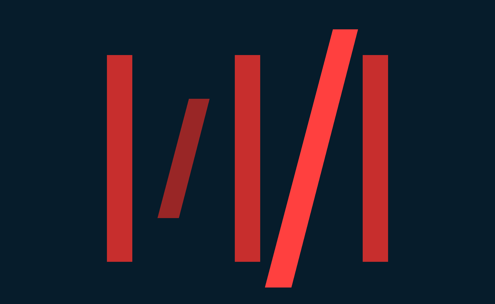

<h1 align="center">From zero to production in less than a day</h1>
<h3 align="center">A template for hosting your ML solutions quickly with fastAPI </h3>

Do you have an amazing Machine Learning Solution but you are thinking how to create a webservice out of it? Well this project exactly solves your problem. 
This repo can be used as a kickstarter to convert your local ML application into a running webservice that can be deployed to the server/local.

This is an example project that can help you understand the framework and design of FastAPI that we generaly use in MD.

<h3>Additionaly one can also learn about other activities needed to deploy a solution to servers [Production] involving:</h3>

- Dependency management and packaging in Python using Poetry.
  * How a simple <b><i> pyproject.toml</b></i> looks like for poetry, can be found under each package. 
- Creating the deployable containers of the ML services using Docker.
  * Example <b><i> Dockerfile</b></i> can be found at:
    > example-service-template-service/docker/Dockerfile

---

**[Read the blog on ReadTheDocs for more details!](https://docs.google.com/document/d/1qMOIHVmRWmEGeNc1yt2mZWbot6edQr4TOQo7jOTlDwg/edit?usp=sharing)**

---

## Project Structure

### example-service-template-foundation:
The foundation library may contain shared python code and functions that can be reused in sereval Python projects.

### example-service-template-core:
The core library may contain  python code that are core to a specific project which mainly deals with the actual business logic.

### example-service-template-service:
The service package is the actual package that runs the service.

<h3>P.s:</h3>
<h4>Please read the Read Me for indivitual package.</h4>
You can replace <i>"example-service-template" </i> with your custom package names while renaming the packagesn and add custom packages as per requirment.

## License

MIT

## Change log

Change log can be added here.

## Authors

* **Anustup** anustup@mediadistillery.com
* **Ryan** ryan@mediadistillery.com
